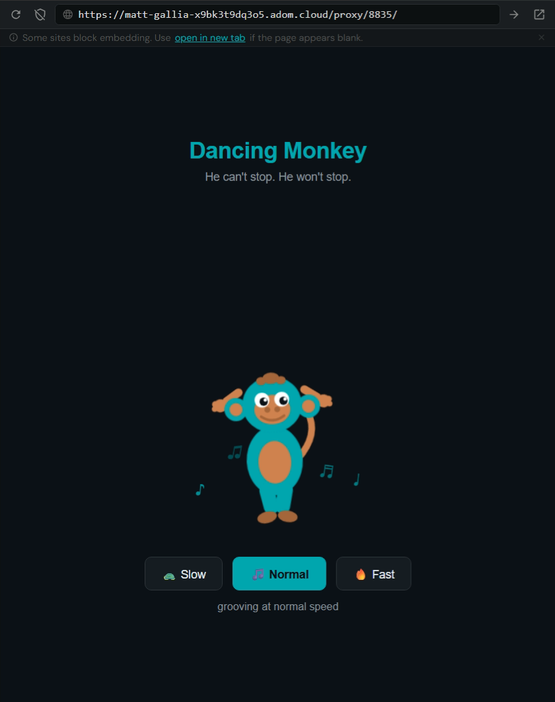

# Sol Monkey

He can't stop. He won't stop.



---

## Table of Contents

1. [Overview](#overview)
2. [Project Structure](#project-structure)
3. [Running the App](#running-the-app)
4. [Server (server.js)](#server-serverjs)
5. [UI (index.html)](#ui-indexhtml)
   - [Color Palette](#color-palette)
   - [Typography](#typography)
   - [Layout](#layout)
   - [Music Notes](#music-notes)
   - [The Monkey SVG](#the-monkey-svg)
   - [CSS Animations](#css-animations)
   - [Speed Controls](#speed-controls)
6. [Favicon (docs/icon.svg)](#favicon-docsiconssvg)
7. [Hydrogen Workspace Integration](#hydrogen-workspace-integration)
8. [Environment Variables](#environment-variables)

---

## Overview

Sol Monkey is a self-contained Node.js web app that renders an animated monkey dancing in a browser window. It has no dependencies beyond the Node.js standard library. When started, it:

1. Serves a static HTML page on port **8835**
2. Automatically opens itself as a **Hydrogen webview tab** inside the Adom IDE using `adom-cli`
3. Loops a fully CSS-animated SVG monkey indefinitely with floating music notes and a speed selector

---

## Project Structure

```
sol-monkey/
├── server.js          # HTTP server + Hydrogen tab launcher
├── index.html         # Entire UI: layout, SVG monkey, CSS animations, JS controls
└── docs/
    ├── icon.svg       # Monkey face favicon / tab icon
    └── screenshot.png # README screenshot
```

---

## Running the App

```bash
node server.js
```

No `npm install` required — zero external dependencies.

The server starts on port **8835** and, if running inside an Adom workspace, automatically opens a Hydrogen webview tab pointed at the app.

---

## Server (server.js)

### Static file server

The server is a plain `http.createServer` handler with a small MIME type map:

| Extension | Content-Type           |
|-----------|------------------------|
| `.html`   | `text/html`            |
| `.svg`    | `image/svg+xml`        |
| `.css`    | `text/css`             |
| `.js`     | `application/javascript` |

All other extensions fall back to `text/plain`.

URL routing is minimal:

| Request URL    | File served          |
|----------------|----------------------|
| `/`            | `index.html`         |
| `/favicon.svg` | `docs/icon.svg`      |
| anything else  | path joined to `__dirname` |

Files are read with `fs.readFile` and streamed directly to the response. A missing file returns a bare `404 Not found`.

### Hydrogen tab auto-open

After the server binds to `0.0.0.0:8835`, the startup callback:

1. **Builds the app URL** — reads `VSCODE_PROXY_URI` (set by the Adom workspace) and substitutes `{{port}}` with `8835`. Falls back to `http://127.0.0.1:8835/` when running outside Adom.
2. **Encodes the favicon** — reads `docs/icon.svg`, base64-encodes it, and creates a `data:image/svg+xml;base64,...` URI for the tab icon.
3. **Finds the active panel** — calls `adom-cli hydrogen workspace tabs` (JSON output) and reads `tabs[0].panelId`.
4. **Opens the tab** — calls `adom-cli hydrogen workspace add-tab` with:
   - `--panel-id` — the panel retrieved above
   - `--panel-type` `adom/a1b2c3d4-0031-4000-a000-000000000031` (Hydrogen webview type)
   - `--display-name` `"Dancing Monkey"`
   - `--display-icon` — the base64 SVG data URI
   - `--initial-state` — JSON with the app URL: `{"url":"<proxy-url>"}`

Both `adom-cli` calls are wrapped in a `try/catch`; if either fails (e.g. running outside an Adom workspace), the server continues normally and just logs the error.

---

## UI (index.html)

The entire frontend is a single self-contained HTML file — no external JS libraries, no build step.

### Color Palette

All colors are defined as CSS custom properties on `:root`:

| Variable          | Hex       | Used for                        |
|-------------------|-----------|---------------------------------|
| `--bg`            | `#0d1117` | Page background                 |
| `--surface`       | `#161b22` | Button default background       |
| `--surface2`      | `#1c2129` | Button hover background         |
| `--border`        | `#30363d` | Button border                   |
| `--text`          | `#e6edf3` | Primary text                    |
| `--text-dim`      | `#8b949e` | Subtitle and speed label        |
| `--accent`        | `#00b8b0` | Teal — heading, notes, monkey body |
| `--monkey-brown`  | `#c97d4e` | Monkey skin patches             |
| `--monkey-dark`   | `#a0623a` | Darker brown — feet, nostrils, smile |

### Typography

Two fonts are imported from `https://adom.inc/fonts/`:

- **Familjen Grotesk** — used for the `<h1>` heading only
- **Satoshi** — used for everything else (body, buttons, labels)

### Layout

The page uses a full-viewport flexbox column (`height: 100vh`, `overflow: hidden`) centered both horizontally and vertically. Content order top-to-bottom:

1. `<h1>` — "Dancing Monkey" in teal
2. `<p>` — "He can't stop. He won't stop." in dim text
3. `.stage` — 320×380px relative container holding the notes and monkey
4. `.controls` — row of three speed buttons
5. `.speed-label` — current speed description text

### Music Notes

Four Unicode music note characters (`♪ ♫ ♩ ♬`) are absolutely positioned inside `.stage`:

```
note 1  left: 60px   delay: 0s    duration: 2.1s
note 2  left: 100px  delay: 0.5s  duration: 1.8s
note 3  right: 60px  delay: 1s    duration: 2.3s
note 4  right: 90px  delay: 1.5s  duration: 1.9s
```

Each note runs the `floatnote` keyframe animation:

| Keyframe | opacity | transform                              |
|----------|---------|----------------------------------------|
| 0%       | 0       | `translateY(0) scale(0.8)`             |
| 20%      | 1       | *(fade in)*                            |
| 100%     | 0       | `translateY(-120px) scale(1.2) rotate(15deg)` |

Notes fade in, float upward 120px, grow slightly, rotate 15°, and fade out — then immediately repeat (`infinite`).

### The Monkey SVG

The monkey is a 160×200px SVG (`viewBox="0 0 160 200"`). Parts are drawn in back-to-front painter's order so overlapping elements composite correctly. Every part uses only the three brown/teal/dark-brown palette colors.

#### Tail
A cubic bezier `<path>` from `(105,120)` curving right and up to `(115,60)`. Stroke color `#c97d4e`, width 8, `stroke-linecap="round"`, no fill.

#### Left Arm
A `<g class="arm-left">` group containing:
- A rounded rectangle (`rx="5"`) for the upper arm
- Three overlapping circles forming a 3-fingered hand at the far left end

#### Right Arm
Mirror of the left arm, positioned on the right side.

#### Body
An ellipse centered at `(80,120)`, radii `34×42`, filled teal. Overlaid with a smaller belly patch ellipse at `(80,122)`, radii `20×26`, filled brown.

#### Left Leg
A `<g class="leg-left">` group: a tall rounded rectangle for the thigh/shin, plus an ellipse foot at the bottom in dark brown.

#### Right Leg
Mirror of the left leg.

#### Ears
Two pairs of concentric circles — outer circle teal (r=14), inner circle brown (r=8) — positioned at x=36 and x=124, both at y=56.

#### Head
A teal ellipse centered at `(80,52)`, radii `36×34`.

#### Face Patch
A brown ellipse centered at `(80,58)`, radii `22×18`, overlaid on the lower half of the head.

#### Eyes
- **Whites**: two white circles (r=9) in a `<g class="eye-whites">` — left at `(68,46)`, right at `(92,46)`
- **Pupils**: two dark (`#0d1117`) circles (r=5) offset slightly down and right from center
- **Shine dots**: two small white circles (r=2) overlaid on each pupil for a glossy highlight

#### Nostrils
Two dark-brown circles (r=3.5) at `(74,58)` and `(86,58)`.

#### Smile
A quadratic bezier path: `M66 66 Q80 76 94 66` — starts at the left cheek, curves down through `(80,76)`, ends at the right cheek. Dark-brown stroke, width 3, round caps, no fill.

#### Hair Tuft
Three overlapping dark-brown ellipses at the top of the head:
- Center tuft: `(80,20)` — `10×7`
- Left tuft: `(68,23)` — `6×5`
- Right tuft: `(92,23)` — `6×5`

### CSS Animations

All animations run `infinite alternate` (ping-pong) except `floatnote` and `blink` which run `infinite` (loop from start).

#### `bodybounce` — whole monkey container
```css
from { transform: translateY(0)    rotate(-3deg); }
to   { transform: translateY(-14px) rotate(3deg); }
```
The monkey bounces up 14px and rocks ±3° side to side. `transform-origin: bottom center` so it pivots from its feet. Duration: 0.5s (normal speed).

#### `armleft` — left arm group
```css
from { transform: rotate(-40deg); }
to   { transform: rotate(30deg); }
```
`transform-origin: 38px 38px` (shoulder joint). Left arm swings forward and back.

#### `armright` — right arm group
```css
from { transform: rotate(40deg); }
to   { transform: rotate(-30deg); }
```
`transform-origin: 122px 38px`. Opposite phase to the left arm.

#### `legleft` — left leg group
```css
from { transform: rotate(-15deg); }
to   { transform: rotate(15deg); }
```
`transform-origin: 62px 130px` (hip joint). Left leg kicks front and back.

#### `legright` — right leg group
```css
from { transform: rotate(15deg); }
to   { transform: rotate(-15deg); }
```
`transform-origin: 98px 130px`. Opposite phase — left leg forward = right leg back.

#### `tailwag` — tail group
```css
from { transform: rotate(-20deg); }
to   { transform: rotate(20deg); }
```
`transform-origin: 105px 110px` (tail base). Tail sweeps ±20°.

#### `blink` — eye whites group
```css
0%, 90%, 100% { transform: scaleY(1);   }
95%           { transform: scaleY(0.1); }
```
Duration: 3s. Eyes stay fully open for 90% of the cycle, then snap nearly shut at 95% and reopen by 100%. Simulates a natural blink.

### Speed Controls

Three buttons call `setSpeed(s)` with `'slow'`, `'normal'`, or `'fast'`:

| Speed  | `animationDuration` | Label                    |
|--------|---------------------|--------------------------|
| slow   | `1s`                | taking it easy           |
| normal | `0.5s`              | grooving at normal speed |
| fast   | `0.18s`             | absolutely losing it     |

`setSpeed` applies the new duration to every animated element:

```js
document.querySelectorAll('.monkey, .arm-left, .arm-right, .leg-left, .leg-right, .tail')
  .forEach(el => { el.style.animationDuration = dur; });
```

Note: `.eye-whites` and `.note` elements are intentionally excluded — the blink and floating notes always run at their own fixed cadence regardless of dance speed.

The active button gets class `.active` (teal background, dark text, bold), all others are reset to default.

---

## Favicon (docs/icon.svg)

A 64×64 SVG monkey face used as both the browser tab favicon and the Hydrogen tab icon. Contains:

- Two teal outer ears (r=7) + brown inner ears (r=4) at x=12 and x=52
- Teal head ellipse (`18×17`)
- Brown face patch ellipse (`11×9`)
- White eye circles (r=4) + dark pupils (r=2)
- Two brown nostrils (r=2)
- Quadratic bezier smile: `M25 32 Q32 38 39 32`

---

## Hydrogen Workspace Integration

The app uses two `adom-cli` commands at startup (via Node's `execSync`):

```bash
# Get list of open workspace tabs
adom-cli hydrogen workspace tabs

# Open a new webview tab in the active panel
adom-cli hydrogen workspace add-tab \
  --panel-id "<panelId>" \
  --panel-type "adom/a1b2c3d4-0031-4000-a000-000000000031" \
  --display-name "Dancing Monkey" \
  --display-icon "<base64-svg-data-uri>" \
  --initial-state '{"url":"<app-url>"}'
```

Panel type `adom/a1b2c3d4-0031-4000-a000-000000000031` is the Hydrogen generic web view panel. The `initial-state` JSON tells it which URL to load.

---

## Environment Variables

| Variable           | Default                        | Purpose                                      |
|--------------------|--------------------------------|----------------------------------------------|
| `VSCODE_PROXY_URI` | `http://127.0.0.1:{{port}}/`   | Proxy URL template. Adom workspaces set this automatically to the public HTTPS proxy URL. `{{port}}` is replaced with `8835` at runtime. |
